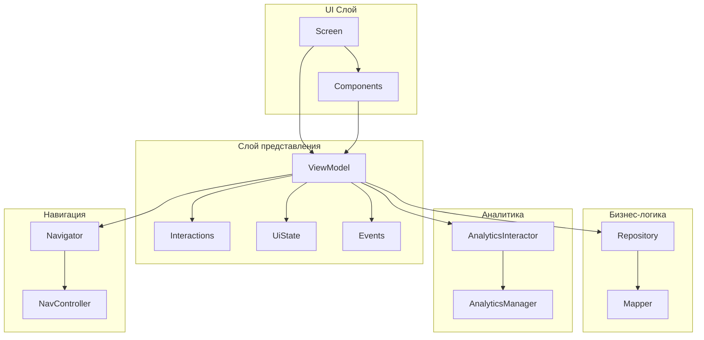
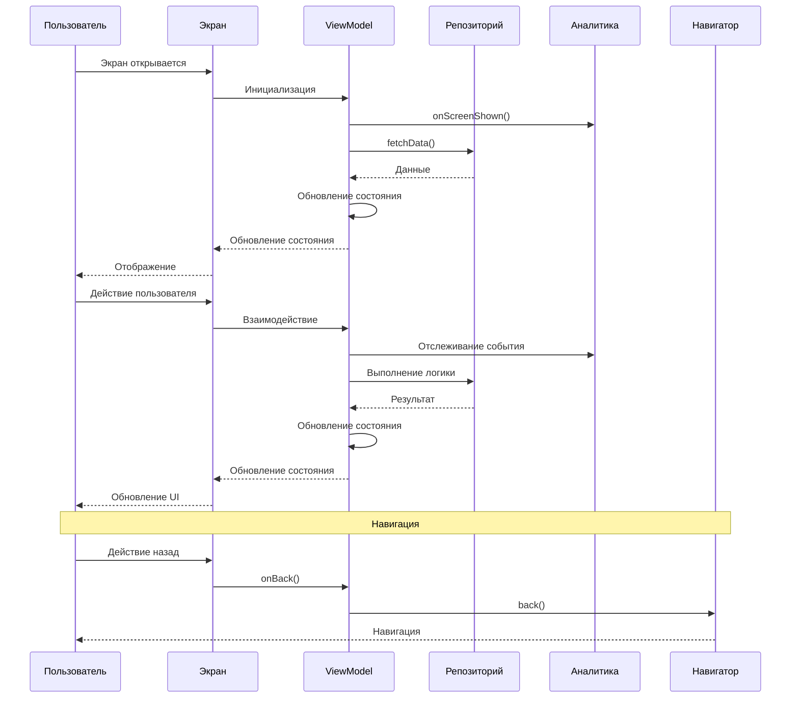

# Архитектура: Стандартный модуль фичи

## Обзор

Этот документ описывает стандартную архитектуру модуля фичи в монорепозитории tc-mono, основанную на TemplateScreenPlugin и существующих реализациях фич. Основное внимание уделяется модулям `feature/` и `view/`.

## Структура модуля

Стандартный модуль фичи состоит из двух основных модулей:

```
myFeature/
├── model/                  # Доменные модели и интерфейсы
├── feature/                # Основная реализация фичи
└── view/                   # Переиспользуемые UI компоненты
```

## Модуль фичи (`feature/`)

Модуль фичи является ядром реализации фичи, содержащим всю бизнес-логику, слой представления и UI компоненты.

### Структура директорий

```
myFeature/feature/
├── src/commonMain/kotlin/com/xfivetech/myfeature/
│   ├── analytics/                    # Отслеживание аналитики
│   │   ├── MyFeatureAnalyticsInteractor.kt
│   │   ├── MyFeatureAnalyticsParams.kt
│   │   └── MyFeatureEvents.kt
│   ├── di/                           # Внедрение зависимостей
│   │   └── MyFeatureModule.kt         # Единый DI модуль
│   ├── MyFeatureViewModel.kt         # ViewModel с управлением состоянием и событиями
│   ├── MyFeatureInteractions.kt      # Интерфейс взаимодействия пользователя
│   ├── MyFeatureUiState.kt           # Модель состояния UI
│   ├── MyFeatureEvent.kt             # Одноразовые события
│   ├── MyFeatureScreen.kt            # Публичная точка входа (с DI) и внутренняя реализация (перегрузка функции)
│   ├── MyFeatureNavigator.kt         # Интерфейс навигации
│   └── components/                   # Переиспользуемые UI компоненты
│       └── MyFeatureComponent.kt
├── src/commonTest/kotlin/com/xfivetech/myfeature/
│   └── [тестовые файлы]
└── build.gradle.kts
```

### Архитектура модуля фичи



### Детальный разбор компонентов

#### 1. Слой аналитики (`analytics/`)

**Назначение**: Отслеживание взаимодействий пользователя и событий экрана.

**Файлы**:
- `MyFeatureAnalyticsInteractor.kt` - Инкапсулирует логику аналитики
- `MyFeatureAnalyticsParams.kt` - Параметры событий аналитики
- `MyFeatureEvents.kt` - Определения событий

**Пример**:

```kotlin
// MyFeatureAnalyticsInteractor.kt
public class MyFeatureAnalyticsInteractor(
    private val analyticsManager: AnalyticsManager,
) {
    public fun onScreenShown() {
        val event = MyFeatureEvents.onScreenShownEvent()
        analyticsManager.logEvent(event)
    }
    
    public fun onButtonClick(buttonName: String) {
        val event = MyFeatureEvents.onButtonClickEvent(buttonName)
        analyticsManager.logEvent(event)
    }
}

// MyFeatureEvents.kt
public object MyFeatureEvents {
    internal fun onScreenShownEvent() = AnalyticsEvent(
        name = EVENT_NAME_VIEW,
        params = MyFeatureAnalyticsParams(
            objectValue = OBJECT_SCREEN,
            subject = SUBJECT_SYSTEM,
        ).toAnalyticsMap(),
    )
    
    internal fun onButtonClickEvent(buttonName: String) = AnalyticsEvent(
        name = "button_click",
        params = mapOf(
            "button_name" to buttonName,
        ),
    )
}
```

**Ответственность**:
- Отслеживать события показа экрана
- Отслеживать взаимодействия пользователя
- Инкапсулировать логику аналитики
- Обеспечивать типобезопасное создание событий

#### 2. Внедрение зависимостей (`di/`)

**Назначение**: Настройка зависимостей Koin для фичи.

**Файлы**:
- `MyFeatureModule.kt` - Единый DI модуль

**Пример**:

```kotlin
// MyFeatureModule.kt
public val myFeatureModule: Module = module {
    // Аналитика
    factoryOf(::MyFeatureAnalyticsInteractor)

    // ViewModels
    viewModel { (initialValue: String?, myFeatureNavigator: MyFeatureNavigator) ->
        MyFeatureViewModel(
            initialValue = initialValue,
            navigator = myFeatureNavigator,
            analyticsInteractor = get(),
            repository = get(),
            uiMapper = get(),
            coroutineScope = get<TCCoroutineScopeFactory>().create(tag = "MyFeatureViewModel"),
        )
    }
}
```

**Ответственность**:
- Настройка зависимостей Koin
- Предоставление фабрик ViewModel
- Предоставление интеракторов и мапперов
- Управление синглтонами

#### 3. Слой представления

**Назначение**: Управление состоянием UI и обработка взаимодействий пользователя.

**Файлы**:
- `MyFeatureViewModel.kt` - Основной ViewModel
- `MyFeatureInteractions.kt` - Интерфейс взаимодействия пользователя
- `MyFeatureUiState.kt` - Модель состояния UI
- `MyFeatureEvent.kt` - Одноразовые события

**Пример**:

```kotlin
// MyFeatureViewModel.kt
public class MyFeatureViewModel(
    initialValue: String?,
    private val navigator: MyFeatureNavigator,
    private val analyticsInteractor: MyFeatureAnalyticsInteractor,
    private val repository: MyFeatureRepository,
    coroutineScope: CoroutineScope,
) : ViewModel(coroutineScope), MyFeatureInteractions {

    private val _state = MutableStateFlow(MyFeatureUiState.initial(initialValue))
    public val state: StateFlow<MyFeatureUiState> = _state.asStateFlow()

    private val _events = MutableSharedFlow<MyFeatureEvent>(
        extraBufferCapacity = 1,
        onBufferOverflow = BufferOverflow.DROP_OLDEST,
    )
    public val events: SharedFlow<MyFeatureEvent> = _events.asSharedFlow()

    init {
        loadData()
    }

    public fun onScreenShown() {
        analyticsInteractor.onScreenShown()
    }

    override fun onBack() {
        navigator.back()
    }

    override fun onButtonClick(buttonId: String) {
        analyticsInteractor.onButtonClick(buttonId)
        // Обработка нажатия кнопки
    }

    private fun loadData() {
        viewModelScope.launch {
            _state.value = _state.value.copy(isLoading = true)
            
            when (val result = repository.fetchData()) {
                is Result.Success -> {
                    val uiModel = uiMapper.toUiModel(result.value)
                    _state.value = _state.value.copy(
                        isLoading = false,
                        data = uiModel,
                    )
                }
                is Result.Failure -> {
                    _state.value = _state.value.copy(
                        isLoading = false,
                        error = result.exception.message,
                    )
                    _events.tryEmit(MyFeatureEvent.ShowErrorDialog(result.exception.message ?: "Неизвестная ошибка"))
                }
            }
        }
    }
}

// MyFeatureInteractions.kt
internal interface MyFeatureInteractions {
    fun onBack()
    fun onButtonClick(buttonId: String)
    fun onItemSelected(itemId: String)

    companion object {
        fun mock() = object : MyFeatureInteractions {
            override fun onBack() = Unit
            override fun onButtonClick(buttonId: String) = Unit
            override fun onItemSelected(itemId: String) = Unit
        }
    }
}

// MyFeatureUiState.kt
public data class MyFeatureUiState(
    public val isLoading: Boolean = false,
    public val data: MyFeatureUiModel? = null,
    public val error: String? = null,
    public val title: String? = null,
) {
    companion object {
        fun initial(initialValue: String?) = MyFeatureUiState(
            title = initialValue,
        )
    }
}

// MyFeatureEvent.kt
public sealed class MyFeatureEvent {
    public data class ShowErrorDialog(
        public val message: String,
    ) : MyFeatureEvent()
    
    public data class NavigateToDetail(
        public val itemId: String,
    ) : MyFeatureEvent()
    
    public object ShowSuccessToast : MyFeatureEvent()
}

```

**Ответственность**:
- Управление состоянием UI с использованием `StateFlow`
- Отправка одноразовых событий через `SharedFlow`
- Обработка взаимодействий пользователя
- Координация с репозиториями
- Отслеживание событий аналитики
- Маппинг доменных моделей в UI модели

#### 5. UI Слой

**Назначение**: Компоненты Compose UI и реализация экрана.

**Файлы**:
- `MyFeatureScreen.kt` - Публичная точка входа (с DI) и внутренняя реализация экрана
- `MyFeatureNavigator.kt` - Интерфейс навигации
- `components/MyFeatureComponent.kt` - Переиспользуемые компоненты

**Пример**:

```kotlin
// MyFeatureScreen.kt - Публичная точка входа с DI
@Composable
public fun MyFeatureScreen(
    initialValue: String?,
    modifier: Modifier = Modifier,
    navigator: MyFeatureNavigator,
) {
    val viewModel: MyFeatureViewModel = koinViewModel<MyFeatureViewModel> {
        parametersOf(initialValue, navigator)
    }

    val state by viewModel.state.collectAsStateWithLifecycle()
    val events = viewModel.events.collectAsStateWithLifecycle(initialValue = null)
    
    LaunchedEffect(Unit) {
        viewModel.onScreenShown()
    }
    
    // Обработка событий
    LaunchedEffect(events.value) {
        events.value?.let { event ->
            when (event) {
                is MyFeatureEvent.ShowErrorDialog -> {
                    // Показать диалог ошибки
                }
                is MyFeatureEvent.NavigateToDetail -> {
                    navigator.navigateToDetail(event.itemId)
                }
                is MyFeatureEvent.ShowSuccessToast -> {
                    // Показать тост
                }
            }
        }
    }
    
    MyFeatureScreen(
        state = state,
        interactions = viewModel,
        modifier = modifier,
    )
}

// MyFeatureScreen.kt - Внутренняя реализация
@Composable
internal fun MyFeatureScreen(
    state: MyFeatureUiState,
    interactions: MyFeatureInteractions,
    modifier: Modifier,
) {
    Box(
        modifier = modifier
            .background(DS.colors.background.primary)
            .fillMaxSize(),
    ) {
        when {
            state.isLoading -> {
                LoadingIndicator()
            }
            state.error != null -> {
                ErrorView(
                    message = state.error,
                    onRetry = { /* Обработка повтора */ },
                )
            }
            state.data != null -> {
                MyFeatureContent(
                    data = state.data,
                    interactions = interactions,
                )
            }
        }
    }
}

// MyFeatureNavigator.kt
public interface MyFeatureNavigator {
    public fun back()
    public fun navigateToDetail(itemId: String)
    public fun navigateToSettings()
}

// components/MyFeatureComponent.kt
@Composable
public fun MyFeatureComponent(
    data: MyFeatureUiModel,
    onClick: () -> Unit,
    modifier: Modifier = Modifier,
) {
    Card(
        modifier = modifier.fillMaxWidth(),
        onClick = onClick,
    ) {
        Column(
            modifier = Modifier.padding(16.dp),
        ) {
            Text(
                text = data.title,
                style = DS.typography.headlineSmall,
            )
            Text(
                text = data.description,
                style = DS.typography.bodyMedium,
            )
        }
    }
}
```

**Ответственность**:
- Предоставление публичной точки входа с DI (перегрузка функции)
- Реализация внутреннего UI с использованием Compose
- Обработка взаимодействий пользователя
- Отображение состояний загрузки, ошибки и успеха
- Предоставление переиспользуемых компонентов
- Интеграция с навигацией

### Поток данных модуля фичи



## Модуль модели (`model/`)

Модуль модели содержит доменные модели и интерфейсы для фичи. Это легковесный модуль, который определяет контракты и структуры данных, используемые фичей.

### Структура директорий

```
myFeature/model/
├── src/commonMain/kotlin/com/xfivetech/myfeature/
│   ├── domain/                       # Доменные интерфейсы
│   │   └── MyFeatureRepository.kt    # Интерфейс репозитория
│   └── data/                         # Доменные модели
│       └── MyFeatureData.kt          # Доменная модель данных
└── build.gradle.kts
```

### Пример

```kotlin
// domain/MyFeatureRepository.kt
public interface MyFeatureRepository {
    public suspend fun fetchData(): Result<MyFeatureData>
}

// data/MyFeatureData.kt
public data class MyFeatureData(
    public val id: String,
    public val title: String,
    public val description: String?,
)
```

**Ответственность**:
- Определение доменных моделей
- Объявление интерфейсов репозиториев
- Предоставление типобезопасных контрактов
- Обеспечение инверсии зависимостей

## Модуль представления (`view/`)

Модуль представления содержит переиспользуемые UI компоненты, которые могут использоваться в нескольких фичах.

### Структура директорий

```
myFeature/view/
├── src/commonMain/kotlin/com/xfivetech/myfeature/
│   ├── MyFeatureComponent.kt          # Основной компонент
│   ├── MyFeatureGrid.kt               # Сетка
│   ├── MyFeatureCarousel.kt           # Компонент карусели
│   ├── MyFeatureTitle.kt              # Компонент заголовка
│   └── MyFeatureUiModel.kt            # UI модель для компонентов
└── build.gradle.kts
```

### Примеры компонентов

#### 1. Основной компонент

```kotlin
@Composable
public fun MyFeatureComponent(
    data: MyFeatureUiModel,
    onClick: () -> Unit,
    modifier: Modifier = Modifier,
) {
    Card(
        modifier = modifier.fillMaxWidth(),
        onClick = onClick,
        shape = DS.shapes.medium,
        colors = CardDefaults.cardColors(
            containerColor = DS.colors.surface.primary,
        ),
    ) {
        Column(
            modifier = Modifier.padding(16.dp),
            verticalArrangement = Arrangement.spacedBy(8.dp),
        ) {
            Text(
                text = data.title,
                style = DS.typography.titleMedium,
                color = DS.colors.text.primary,
            )
            if (data.description != null) {
                Text(
                    text = data.description,
                    style = DS.typography.bodyMedium,
                    color = DS.colors.text.secondary,
                )
            }
        }
    }
}
```

#### 2. Компонент сетки

```kotlin
@Composable
public fun MyFeatureGrid(
    items: List<MyFeatureUiModel>,
    onItemClick: (MyFeatureUiModel) -> Unit,
    modifier: Modifier = Modifier,
) {
    LazyVerticalGrid(
        columns = GridCells.Fixed(2),
        modifier = modifier,
        horizontalArrangement = Arrangement.spacedBy(8.dp),
        verticalArrangement = Arrangement.spacedBy(8.dp),
        contentPadding = PaddingValues(8.dp),
    ) {
        items(
            items = items,
            key = { it.id },
        ) { item ->
            MyFeatureComponent(
                data = item,
                onClick = { onItemClick(item) },
            )
        }
    }
}
```

#### 3. Компонент карусели

```kotlin
@Composable
public fun MyFeatureCarousel(
    items: List<MyFeatureUiModel>,
    onItemClick: (MyFeatureUiModel) -> Unit,
    modifier: Modifier = Modifier,
) {
    val pagerState = rememberPagerState(
        pageCount = { items.size },
    )
    
    HorizontalPager(
        state = pagerState,
        modifier = modifier.fillMaxWidth(),
        contentPadding = PaddingValues(horizontal = 32.dp),
        pageSpacing = 16.dp,
    ) { page ->
        MyFeatureComponent(
            data = items[page],
            onClick = { onItemClick(items[page]) },
            modifier = Modifier.fillMaxWidth(),
        )
    }
    
    PaginationDots(
        pageCount = items.size,
        currentPage = pagerState.currentPage,
        modifier = Modifier
            .align(Alignment.CenterHorizontally)
            .padding(vertical = 16.dp),
    )
}
```

#### 4. Компонент заголовка

```kotlin
@Composable
public fun MyFeatureTitle(
    title: String,
    subtitle: String? = null,
    modifier: Modifier = Modifier,
) {
    Column(
        modifier = modifier.padding(horizontal = 16.dp, vertical = 8.dp),
    ) {
        Text(
            text = title,
            style = DS.typography.headlineSmall,
            color = DS.colors.text.primary,
        )
        if (subtitle != null) {
            Text(
                text = subtitle,
                style = DS.typography.bodyMedium,
                color = DS.colors.text.secondary,
            )
        }
    }
}
```

#### 5. UI Модель

```kotlin
public data class MyFeatureUiModel(
    public val id: String,
    public val title: String,
    public val description: String? = null,
    public val imageUrl: String? = null,
    public val metadata: Map<String, Any> = emptyMap(),
)
```

### Ответственность модуля представления

- Предоставление переиспользуемых UI компонентов
- Определение UI моделей для компонентов
- Поддержка различных паттернов разметки (сетка, карусель, список)
- Обеспечение согласованного стиля с DS
- Поддержка превью для компонентов

## Стратегия тестирования

### Тесты модуля модели

```
myFeature/model/src/commonTest/kotlin/com/xfivetech/myfeature/
└── domain/
    └── MyFeatureRepositoryTest.kt
```

### Тесты модуля фичи

```
myFeature/feature/src/commonTest/kotlin/com/xfivetech/myfeature/
├── analytics/
│   └── MyFeatureAnalyticsInteractorTest.kt
├── MyFeatureViewModelTest.kt
└── MyFeatureScreenTest.kt
```

### Примеры тестов

#### Тест ViewModel

```kotlin
class MyFeatureViewModelTest {
    @Test
    fun `когда экран показан, то отслеживается событие аналитики`() = runTest {
        // Дано
        val analyticsInteractor = FakeMyFeatureAnalyticsInteractor()
        val viewModel = createViewModel(analyticsInteractor = analyticsInteractor)
        
        // Когда
        viewModel.onScreenShown()
        
        // Тогда
        assertTrue(analyticsInteractor.screenShownCalled)
    }
    
    @Test
    fun `когда загрузка данных успешна, то обновляется состояние с данными`() = runTest {
        // Дано
        val data = MyFeatureData(id = "1", title = "Тест")
        val repository = FakeMyFeatureRepository(data = data)
        
        // Когда
        val viewModel = createViewModel(repository = repository)
        advanceUntilIdle()
        
        // Тогда
        assertEquals(data.title, viewModel.state.value.data?.title)
        assertFalse(viewModel.state.value.isLoading)
    }
}

// Фейковая реализация для тестирования
class FakeMyFeatureAnalyticsInteractor : MyFeatureAnalyticsInteractor {
    var screenShownCalled = false
    
    override fun onScreenShown() {
        screenShownCalled = true
    }
    
    override fun onButtonClick(buttonName: String) {
        // Реализация для тестов
    }
}

class FakeMyFeatureRepository(
    private val data: MyFeatureData? = null,
    private val error: Exception? = null,
) : MyFeatureRepository {
    override suspend fun fetchData(): Result<MyFeatureData> {
        return if (error != null) {
            Result.failure(error)
        } else {
            Result.success(data!!)
        }
    }
}
```

#### Скриншот тест

```kotlin
class MyFeatureScreenTest {
    @Test
    fun myFeatureScreenLoadingState() {
        paparazzi.snapshot {
            MyFeatureScreen(
                state = MyFeatureUiState(isLoading = true),
                interactions = MyFeatureInteractions.mock(),
                modifier = Modifier,
            )
        }
    }
    
    @Test
    fun myFeatureScreenWithData() {
        paparazzi.snapshot {
            MyFeatureScreen(
                state = MyFeatureUiState(
                    data = MyFeatureUiModel(
                        id = "1",
                        title = "Тестовый заголовок",
                        description = "Тестовое описание",
                    ),
                ),
                interactions = MyFeatureInteractions.mock(),
                modifier = Modifier,
            )
        }
    }
}
```

## Лучшие практики

### 1. Разделение ответственности

- Храните логику UI в ViewModels
- Храните операции с данными в Repositories
- Храните навигацию в Navigators
- Храните аналитику в AnalyticsInteractors

### 2. Управление состоянием

- Используйте `StateFlow` для состояния UI
- Используйте `SharedFlow` для одноразовых событий
- Храните состояние неизменяемым
- Используйте data classes для состояния
- Предоставляйте начальное состояние

### 3. Навигация

- Определяйте интерфейсы навигации
- Реализуйте навигацию в модуле приложения
- Передавайте навигатор в ViewModel
- Используйте sealed classes для событий навигации

### 4. Аналитика

- Отслеживайте события показа экрана
- Отслеживайте взаимодействия пользователя
- Используйте интеракторы аналитики
- Определяйте события в отдельных объектах

### 5. Обработка ошибок

- Используйте sealed classes для состояний ошибок
- Отправляйте ошибки через события
- Показывайте понятные пользователю сообщения
- Логируйте технические детали

### 6. Тестирование

- Пишите модульные тесты для бизнес-логики
- Пишите скриншот тесты для UI
- Используйте фейковые реализации для зависимостей
- Тестируйте граничные случаи

### 7. UI компоненты

- Делайте компоненты переиспользуемыми
- Используйте DS для стилизации
- Предоставляйте функции превью
- Поддерживайте различные состояния

## Конфигурация сборки

### Gradle плагины

Модули фич и представления используют плагин `custom.kmp.compose.library`:

```kotlin
plugins {
    id("custom.kmp.compose.library")
}
```

### Зависимости

Общие зависимости включают:
- Koin для DI
- Compose для UI
- Coroutines для асинхронных операций
- Analytics SDK
- Paparazzi для скриншот тестов

## Интеграция с приложением

### Интеграция навигации

```kotlin
// В навигации приложения
composable(route = MyFeatureRoutes.MyFeatureScreen) { backStackEntry ->
    val navigator = rememberMyFeatureNavigator(navController)
    MyFeatureScreen(
        initialValue = backStackEntry.arguments?.getString("initialValue"),
        navigator = navigator,
    )
}
```

### Загрузка модулей

```kotlin
// В DI приложения
startKoin {
    modules(
        platformModule,
        myFeatureModule,
        // ... другие модули
    )
}
```

## Использование TemplateScreenPlugin

### Настройка

1. Настройте путь к плагину в IntelliJ Settings:
   - Settings → Tools → Template Screen Plugin
   - Установите путь к директории `tc-shared`

2. Нажмите правой кнопкой мыши на директорию фичи
3. Выберите "Create Template Screen"
4. Введите имя экрана
5. Плагин генерирует все необходимые файлы

### Генерируемый код

Плагин:
- Создает структуру директорий экрана
- Заменяет плейсхолдер `template` на имя экрана
- Обновляет объявления пакетов
- Обновляет импорты
- Создает все шаблонные файлы

## Резюме

Стандартная архитектура модуля фичи обеспечивает:

- **Четкое разделение ответственности** между слоями
- **Согласованную структуру** для всех фич
- **Тестируемые компоненты** с четкими границами
- **Переиспользуемые паттерны** через TemplateScreenPlugin
- **Масштабируемый дизайн**, который растет со сложностью фичи
- **Типобезопасную навигацию** и управление состоянием
- **Интегрированную аналитику** отслеживание
- **Комплексное тестирование** поддержку
- **Переиспользуемые UI компоненты** в модуле представления

Эта архитектура обеспечивает поддерживаемость, тестируемость и согласованность во всем монорепозитории tc-mono.
