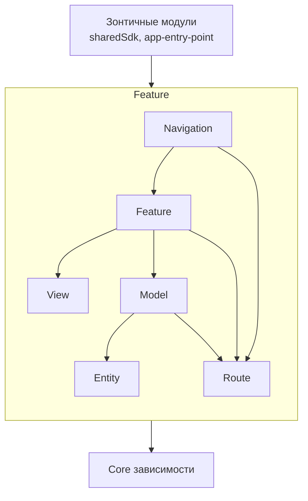
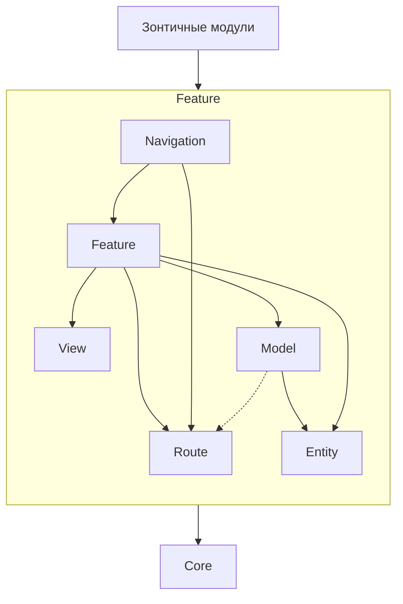

# Правила Feature Sliced Design (FSD)

Этот документ описывает правила архитектуры Feature Sliced Design для проекта. Эти правила следует соблюдать при разработке новых функций или рефакторинге существующего кода.

## Важные правила

- **Добавляйте модули по необходимости** - Не создавайте все модули заранее. Добавляйте их только тогда, когда это необходимо для разрабатываемой функции.
- **Размещение Compose** - Код на Compose размещается только в слоях Feature, View и Navigation.
- **Несколько фич в одной вертикали** - Вертикаль может (и должна) иметь несколько функций в разработке одновременно.
- **Несколько модулей одного типа** - Внутри одной функции может быть несколько модулей одного типа (например, `view-productCard` и `view-cardGallery`).
- **Направление зависимостей** - Ссылки на НИЖНИЕ модули РАЗРЕШЕНЫ. Горизонтальные ссылки ЗАПРЕЩЕНЫ.
- **Модули Core как библиотеки** - Часть модулей Core будет вынесена в компилируемые библиотеки для уменьшения размера сборки.

## Иерархия слоев



**Легенда зависимостей:**

- `Зонтичные модули → Navigation`
- `Navigation → Feature`
- `Navigation → Route`
- `Feature → View`
- `Feature → Model`
- `Feature → Route`
- `Model → Entity`
- `Entity → Core`
- `Все модули → Core`

## Описание слоев

### Core

**Частота изменений:** Нет
**На него могут ссылаться:** Все модули
**Кто может ссылаться:** Все модули

Корневые зависимости. Редко меняются, используются всеми. Не пересекаются между собой. Не зависят друг от друга.

В Core уже есть почти всё, что вам нужно - поэтому новые модули здесь появляются редко. Если вы придумали что-то ещё - приходите обсудить в командный чат.

**Содержит:** Вся фундаментальная инфраструктура в зависимости от типа модуля (сеть, хранилище, DI, аналитика, дизайн-система и т.д.)

---

### Entity

**Частота изменений:** Нет
**На него могут ссылаться:** Да
**Кто может ссылаться в рамках фичи:** Model, Feature

Базовые модели для связи между модулями. Выносим только реально переиспользуемые сущности.

**Содержит:**

- Data классы моделей, нужных между фичами (например, корзина)
- Интерфейсы переиспользуемых репозиториев

---

### Route

**Частота изменений:** Нет
**На него могут ссылаться:** Да
**Кто может ссылаться в рамках фичи:** Navigation, Feature

Переходы между экранами. По сути зависят только от навигации.

Обычный роут состоит из:

- констант `SCREEN_NAME`
- моделей параметров, передаваемых в экран
- методов мапинга экранных параметров в `TCRoute` и обратно

**Примечание:** Слой Route располагается параллельно с View и не зависит от Entity.

---

### Model

**Частота изменений:** Да
**На него могут ссылаться:** Нет
**Кто может ссылаться в рамках фичи:** Feature

Инфраструктура и сервис работы с данными для фичи. Здесь всё, что лежит ниже ViewModel:

**Содержит:**

- API интерфейсы и реализации
- DataStore
- Repository интерфейсы и реализации
- UseCase (в исключительных случаях, когда они ПРАВДА нужны)

---

### View

**Частота изменений:** Нет
**На него могут ссылаться:** Да
**Кто может ссылаться в рамках фичи:** Feature

Pure Compose вьюхи.

- Composable функции
- UI модели и интеракторы для их инициализации
- снапшот тесты

---

### Feature

**Частота изменений:** Да
**На него могут ссылаться:** Нет
**Кто может ссылаться в рамках фичи:** Navigation

ViewModel + экраны + сценарии работы. Вся экранная логика и UI здесь.

- ViewModels
- Screen composables
- Бизнес-логика и управление состоянием
- Обработка взаимодействий пользователя

---

### Navigation

**Частота изменений:** Нет
**На него могут ссылаться:** Нет
**Кто может ссылаться в рамках фичи:** Никто, только зонтичные модули

Описание навигации фичи. Фактически это список SusaniAdapters по перекладыванию нужных Routes на нужные Screens (с учётом некоторых Details).

**Содержит:**

- Определения графа навигации
- Маппинг маршрутов на экраны
- Логика навигации и переходы

---

## Зонтичные модули

Два модуля (`sharedSdk` и `app-entry-point`) для конфигурации и подключения зависимостей, как SDK и полноценное приложение.

**Содержит:**

- Оркестрация DI
- Имплементации модулей
- Сейчас в них лишь добавляются новые зависимости

### sharedSdk

- Зонтичный модуль, предоставляющий iOS framework
- Раскрывает публичный API для внешнего использования
- Содержит конфигурацию DI для режима SDK

### app-entry-point

- Конфигурация точки входа приложения
- Полная настройка DI приложения
- Платформенно-специфичная инициализация

## Правила зависимостей

### Разрешённые зависимости



**Дополнительные зависимости:**

- `Navigation → Route` (навигация использует роуты)
- `Feature → Route` (фича может использовать свои роуты)
- `Route → Core` (роуты могут зависеть от Core)
- `Все модули → Core` (все модули могут ссылаться на Core)

### Запрещённые зависимости

- **Горизонтальные ссылки** между модулями одного слоя
- **Восходящие ссылки** от нижних слоёв к верхним
- **Межфичевые ссылки** кроме через слой Entity

### Примеры

✅ **Разрешено:**

- `Navigation` может зависеть от `Feature`
- `Navigation` может зависеть от `Route`
- `Feature` может зависеть от `View`
- `Feature` может зависеть от `Model`
- `Feature` может зависеть от `Route`
- `Model` может зависеть от `Entity`
- `Entity` может зависеть от `Core`
- Любой модуль может зависеть от `Core`

❌ **Запрещено:**

- `View` зависит от `Feature`
- `Model` зависит от `View`
- `Route` зависит от `Model`
- `Route` зависит от `Entity`
- `Feature-A` зависит от `Feature-B`
- `Navigation` зависит от `Model`
- `Navigation` зависит от `View`

## Соглашения по именованию модулей

Модули фич следуют шаблону:

```
{feature-name}/{layer-type}
```

Примеры:

- `shoppinglist/feature`
- `shoppinglist/model`
- `shoppinglist/view`
- `shoppinglist/route`
- `shoppinglist/navigation`

Для нескольких модулей одного типа внутри фичи:

```
{feature-name}/{layer-type}-{specific-name}
```

Примеры:

- `productCard/view-productCard`
- `productCard/view-cardGallery`

## Когда создавать каждый модуль

### Core

- Только в рамках техзащиты и обсуждения с core командой

### Entity

- Когда у вас есть модели, общие для нескольких фич
- Когда вам нужны переиспользуемые интерфейсы репозиториев

### Route

- Когда вам нужно переходить на эту фичу из навигации
- Когда у фичи несколько экранов с параметрами

### Model

- Когда вам нужна логика уровня данных (API, репозитории и т.д.)
- Когда у вас есть сложные преобразования данных

### View

- Когда у вас есть переиспользуемые UI компоненты

### Feature

- Когда вам нужны новые экраны
- Когда у вас есть логика экрана и управление состоянием
- Когда вам нужны ViewModels
- Когда у вас есть взаимодействия пользователя для обработки

### Navigation

- Когда вам нужно определить навигацию  фичи

## Лучшие практики

1. **Начинайте просто** - Начните с минимального количества модулей, добавляйте больше по мере необходимости
2. **Держите слои тонкими** - Каждый слой должен иметь одну ответственность
3. **Избегайте циклических зависимостей** - Всегда поддерживайте однонаправленный поток
4. **Тестируйте на границах** - Фокусируйте тесты на интерфейсах слоёв
5. **Используйте internal видимость** - По умолчанию `internal`, используйте `public` только когда нужно
6. **Следуйте правилам зависимостей** - Никогда не нарушайте иерархию слоёв

## Руководство по миграции

При миграции существующего кода на FSD:

1. Определите границы фич
2. Вынесите общие сущности в слой Entity
3. Переместите логику данных в слой Model
4. Вынесите переиспользуемый UI в слой View
5. Оставьте логику экрана в слое Feature
6. Определите навигацию в слое Navigation
7. Настройте DI в зонтичных модулях

## Распространённые ошибки

- **Over-engineering** - Создание слишком большого количества модулей заранее
- **Горизонтальные зависимости** - Модули одного уровня зависят друг от друга
- **Бизнес-логика в View** - Размещение сложной логики в composables
- **UI логика в Models** - Размещение состояния UI в репозиториях
- **Отсутствие абстракции** - Прямые зависимости между конкретными реализациями
