# Принцип открытой архитектуры

## Определение

**Открытая архитектура** — это принцип построения приложения, при котором код в проекте не находится в заранее определённом месте, а развивается в зависимости от того, какие задачи на текущий момент стоят перед разработкой.

В отличие от традиционного подхода, где для каждой фичи заранее создаются все слои (entity, model, feature), открытая архитектура предполагает создание модулей только тогда, когда в этом возникает реальная необходимость.

## Основная идея

Согласно принципам FSD (Feature-Sliced Design), определены основные модули. Упрощённая последовательность слоёв выглядит так:

```mermaid
graph TD
    A[Entity] --> B[Model]
    B --> C[Feature]

    style A fill:#001111
    style B fill:#002222
    style C fill:#003333
```



**Ключевой принцип:** не нужно создавать модули под каждый слой сразу. Создавайте и подключайте модули в проект тогда, когда в этом возникает необходимость, а не по умолчанию.

## Пример эволюции модулей

Рассмотрим пример разработки экрана поздравления пользователя.

### Этап 1: Простой экран (только Feature)

**Задача:** Сделать экран с поздравлениями пользователя, где ViewModel нужна только для навигации и аналитики.

**Решение:** Создаём только feature модуль и реализуем в нём все необходимые действия.

```
greeting/
└── feature/
    ├── GreetingViewModel.kt
    └── GreetingScreen.kt
```

**Почему только feature?**

- Нет бизнес-логики
- Нет необходимости в хранении данных
- ViewModel только управляет навигацией и отправляет аналитические события

### Этап 2: Добавляем сохранение состояния (Feature + Model)

**Задача:** Показывать это окно ровно один раз.

**Решение:** Создаём model модуль, в котором декларируем репозиторий и описываем, как с помощью PreferenceManager реализовать данное поведение.

```
greeting/
├── feature/
│   ├── GreetingViewModel.kt
│   └── GreetingScreen.kt
└── model/
    ├── internal/
    │   └── GreetingRepositoryImpl.kt
    └── GreetingRepository.kt
```

**Почему добавили model?**

- Появилась необходимость в сохранении состояния
- Реализация зависит от PreferenceManager (инфраструктура)
- Feature не должен знать о деталях хранения

### Этап 3: Добавляем переиспользование (Entity + Model + Feature)

**Задача:** Пропускать показ экрана поздравления в других фичах.

**Решение:** Создаём entity модуль, где описываем класс поздравления и интерфейс репозитория.

```
greeting/
├── feature/
│   ├── GreetingViewModel.kt
│   └── GreetingScreen.kt
├── model/
│   ├── internal/
│   │   └── GreetingRepositoryImpl.kt
│   └── GreetingRepository.kt
└── entity/
    └── Greeting.kt
```

**Почему добавили entity?**

- Другие фичи должны знать о сущности поздравления
- Интерфейс репозитория должен быть доступен для других модулей
- Реализация остаётся в model

## Правила создания модулей

### Feature модуль

**Создаём, когда:**

- Нужно отобразить UI
- Есть логика навигации
- Нужно отправить аналитические события
- Есть простая бизнес-логика, специфичная для этого экрана

**Не создаём, когда:**

- Фича не имеет UI (например, фоновый сервис)
- Логика может быть переиспользована в других фичах

### Model модуль

**Создаём, когда:**

- Появилась бизнес-логика, которую нужно тестировать отдельно
- Нужна работа с внешними источниками данных (API, база данных, Preferences)
- Реализация зависит от инфраструктуры
- Нужно инкапсулировать сложную логику

**Не создаём, когда:**

- Вся логика простая и находится в ViewModel
- Нет необходимости в тестировании бизнес-логики отдельно

### Entity модуль

**Создаём, когда:**

- Сущности или интерфейсы нужны другим модулям
- Нужно определить контракты для переиспользования
- Появилась общая доменная модель

**Не создаём, когда:**

- Сущности используются только внутри одной фичи
- Нет необходимости в переиспользовании

## Процесс миграции кода между модулями

### Из Feature в Model

1. **Создайте интерфейс репозитория**
2. **Реализуйте репозиторий** в internal папке
3. **Обновите ViewModel** для использования Repository

### Из Model в Entity

1. **Выделите сущности** в отдельный модуль
2. **Переместите интерфейсы** репозиториев в entity
3. **Оставьте реализации** в model
4. **Обновите зависимости** в feature и других модулях

## Примеры сценариев

### Сценарий 1: Экран настроек

**Начало:** Feature модуль с ViewModel и UI

```
settings/
└── feature/
    ├── SettingsViewModel.kt
    └── SettingsScreen.kt
```

**Развитие:** Добавляем сохранение настроек

```
settings/
├── feature/
│   ├── SettingsViewModel.kt
│   └── SettingsScreen.kt
└── model/
    ├── internal/
    │   └── SettingsRepositoryImpl.kt
    └── SettingsRepository.kt
```

**Развитие:** Другие фичи должны читать настройки

```
settings/
├── feature/
│   ├── SettingsViewModel.kt
│   └── SettingsScreen.kt
├── model/
│   ├── internal/
│   │   └── SettingsRepositoryImpl.kt
│   └── SettingsRepository.kt
└── entity/
    └── AppSettings.kt
```

### Сценарий 2: Форма обратной связи

**Начало:** Feature модуль с формой

```
feedback/
└── feature/
    ├── FeedbackViewModel.kt
    └── FeedbackScreen.kt
```

**Развитие:** Добавляем отправку на сервер

```
feedback/
├── feature/
│   ├── FeedbackViewModel.kt
│   └── FeedbackScreen.kt
└── model/
    ├── internal/
    │   ├── FeedbackApi.kt
    │   └── FeedbackRepositoryImpl.kt
    ├── FeedbackRepository.kt
    └── SendFeedbackUseCase.kt
```

## Преимущества открытой архитектуры

1. **Меньше кода** — не создаём лишние модули
2. **Быстрее разработка** — начинаем с простого решения
3. **Лучшая адаптивность** — архитектура развивается вместе с требованиями
4. **Меньше рефакторинга** — не нужно переносить код из "правильных" мест
5. **Чёткая мотивация** — каждый модуль имеет чёткую причину существования

## Риски и как их избежать

### Риск: Недостаточное разделение ответственности

**Решение:** Следите за размером ViewModel. Если она становится большой — выносите логику в Model/Usecases.

### Риск: Сложность миграции

**Решение:** Проектируйте фичу заранее. Если видите, что фича будет развиваться — создайте структуру сразу.

### Риск: Непоследовательность в команде

**Решение:** Документируйте решения и проводите code review с фокусом на архитектуре.

## Чек-лист для принятия решения

Перед созданием нового модуля задайте себе вопросы:

1. **Нужен ли UI?**

   - Да → Создаём Feature
   - Нет → Пропускаем
2. **Есть ли бизнес-логика и платформенные зависимости от источников данных?**

   - Да → Создаём Model
   - Нет → Пропускаем
3. **Нужно ли переиспользование?**

   - Да → Создаём Entity
   - Нет → Пропускаем
4. **Зависит ли реализация от инфраструктуры?**

   - Да → Выносим в Model
   - Нет → Можно оставить в Feature

## Заключение

Принцип открытой архитектуры позволяет развивать проект органично, создавая модули только тогда, когда они действительно нужны. Это подход, который ставит во главу угла практическую пользу вместо теоретической правильности.

Ключ к успеху — постоянная оценка текущих требований и готовность к рефакторингу, когда архитектура перестаёт соответствовать задачам.
