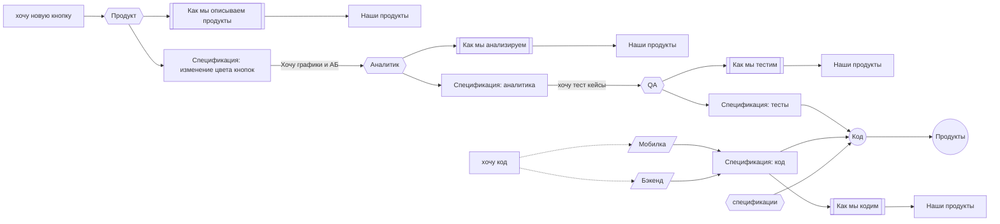

# схема дискавери

```mermaid
graph LR
%% Начальные входы
Start[хочу новую кнопку] --> Prod{{Продукт}}

    %% === Колонка: Продукт ===
    Prod --> Spec1[Спецификация: изменение цвета кнопок]
    Prod --> Doc1[[Как мы описываем продукты]]
    Doc1 --> OurProd1[Наши продукты]
    
    %% Переход к Аналитике
    Spec1 -->|Хочу графики и АБ| Analyst{{Аналитик}}
    
    %% === Колонка: Аналитик ===
    Analyst --> Spec2[Спецификация: аналитика]
    Analyst --> Doc2[[Как мы анализируем]]
    Doc2 --> OurProd2[Наши продукты]
    
    %% Переход к QA
    Spec2 -->|хочу тест кейсы| QA{{QA}}
    
    %% === Колонка: QA ===
    QA --> Spec3[Спецификация: тесты]
    QA --> Doc3[[Как мы тестим]]
    Doc3 --> OurProd3[Наши продукты]
    
    %% === Колонка: Код ===
    %% Входы для разработки
    WantCode[хочу код] -.-> Mobile[/Мобилка/]
    WantCode -.-> Backend[/Бэкенд/]
    
    Mobile --> Spec4[Спецификация: код]
    Backend --> Spec4
    
    %% Сборка спецификаций в Код
    Spec3 --> Code((Код))
    Spec4 --> Code
    ExtraSpecs{{спецификации}} --> Code
    
    %% Процесс кодинга
    Spec4 --> Doc4[[Как мы кодим]]
    Doc4 --> OurProd4[Наши продукты]
    
    %% Финальный результат
    Code --> Final((Продукты))
```